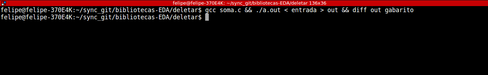

### Principios de Programação Avançada em Linux

Vamos reservar esse tópico para apresentar ferramentas que vão
otimizar sua escrita de código.

##### Utilizando Terminal no Linux

Em um tópico anterior mostramos como usar o VIM, um editor de texto
que trabalha em seu próprio terminal e tems bons motivos para isso:
  * IDE's no geral não deixa muito claro qual erro está ocorrendo
  no código
  * Caso não escolha uma IDE instável existe um grande risco de
  perder código, ter problemas de configuração etc.
  * Quando estiver "codando" em várias disciplinas diferentes
  provavelmente não poderá usar IDE's ou ferramentas de otimização
  (infelizmente).
  * Codar com ferramentas de baixo nível facilita muito sau vida na
  configuração de ambiente (apesar de não parecer).
  * IDE não é tal legal quanto uma tela preta, letra branca e falta
  de mouse

##### Compilando programas em C em sua máquina
Para compilar programar em C precisamos usar o GCC, fique tranquil
caso esteja em uma máquina Linux provavemente já existe em seu
sistema.

```
  gcc <nome_do_arquivo>.c
```

Recomendo compilar com algumas flags ligadas para não ter em
seus exercícios

```
gcc -o <nome_arquivo_saida>.out -W -Wall -ansi -pedantic -I. <nome_arquivo_entrada>.c

```

##### Comando e diretivas úteis no germinal
  * **diff:** diff simplesmente mostra a diferença entre dois
  arquivos de texto, mostrando quais linhas devem sair e quais
  devem entrar

  * **Conector lógico &&:** não é bem um comando mas é vantajoso
  quando precisamos digitar mais de um comando no teminal podemos
  optar por encadealos com o &&, por exemplo <comando 1> && <comando 2>
  executarar o comando 1 e depois do termino da execução o comando 2.]

  * **< :** no terminal "<" signica "pegar o que esta à direita e enviar
  como entrada para  esquerda", muit útil quando precisamos verificar
  erros em código com muitas entradas.

##### Exemplo de utilização
Vamos fazer um programa para somar 2 números usando os conhecimento deste
capitulo:

1° Escrever o programa


2° Escrever arquivos de entrada e saída


3° Compilar


4° Testar

Enviando a entrada


Conferindo se existe diferença com o gabarito


Podemos tudo o que fizemos acima com apenas uma linha, veja:


