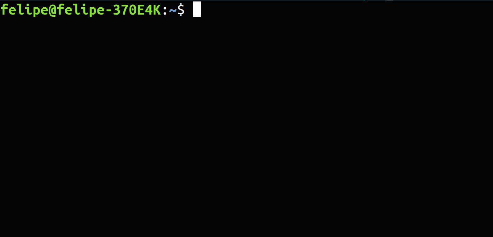
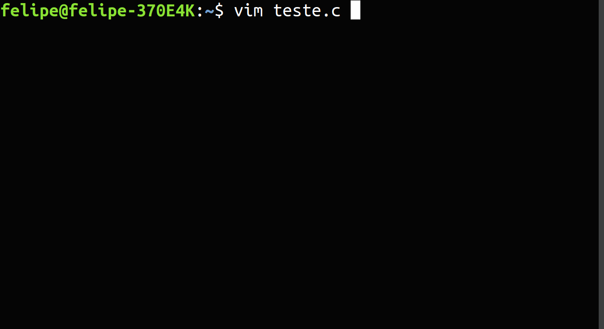
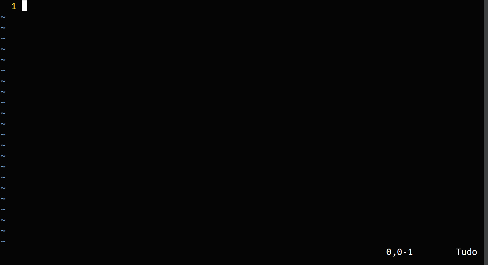

## Utilizando o VIM


### O que é o VIM ?

VIM é um poderoso editor de texto puro criado para editar textos rapidamente e eficientemente. Muito conhecido na área de tecnologia o VIM tem suporte para plugins além de milhares de comandos que auxiliam a edição de arquivos.

___
**Observação:** Existem outras opções além do VIM como NANO ou GEDIT, neste tutorial mostrarei apenas o VIM porém fique a vontade de utilizar qualquer outro. O melhor editor de texto possível é aquele que você consegue utilizar rapidamente.
___

### Abrindo o VIM

O VIM é instalado por padrão no Ubuntu portanto não precisamos instalar nesse sistema.

##### Passo 1

Primeiro vamos abrir o terminal Ubuntu, o programa roda na própria interface do terminal. Para abrir o terminal do sistema Ubuntu preciamos digita o atalho:

```
  CTRL + ALT + T
```

##### Passo 2

Agora precisamos digitar no terminal o comando abaixo para nomear o arquivo e entrar no sistema.

_**Observação:** Quando digitamos o nome também devemos colocar a extensão do arquivo que vamos trabalhar, como por exemplo :'.c', '.txt', '.py'._

```
vim <nome_do_arquivo.extensao_do_arquivo>
```

Vamos criar um arquivo de teste em C para treinar melhor:

Aqui tenho o meu terminal aberto



Vamos criar um arquivo '.c' chamado teste:



Após isso o terminal abre uma instância no VIM do arquivo teste.c


