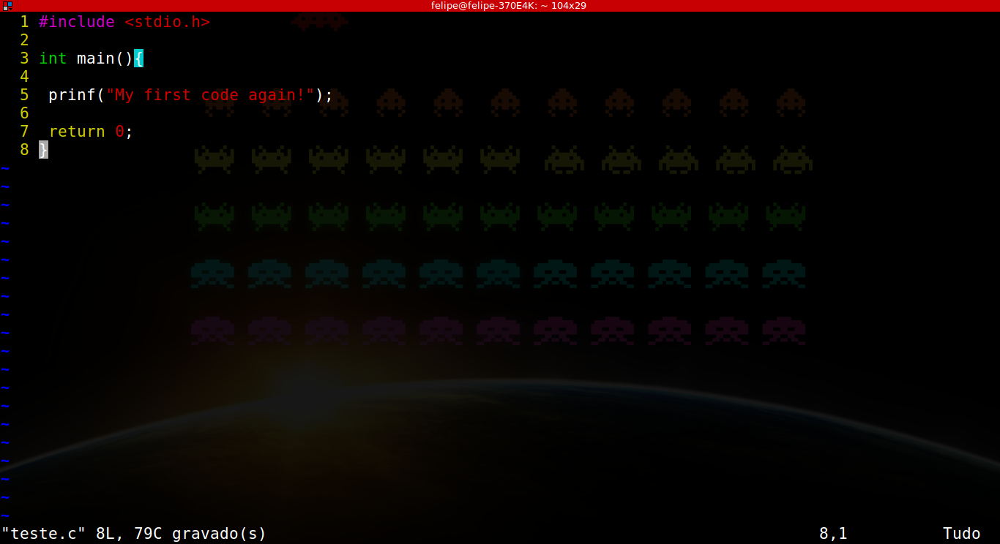

## Utilizando o VIM


### O que é o VIM ?

VIM é um poderoso editor de texto puro criado para editar textos rapidamente e eficientemente. Muito conhecido na área de tecnologia o VIM tem suporte para plugins além de milhares de comandos que auxiliam a edição de arquivos.

___
**Observação:** Existem outras opções além do VIM como NANO ou GEDIT, neste tutorial mostrarei apenas o VIM porém fique a vontade de utilizar qualquer outro. O melhor editor de texto possível é aquele que você consegue utilizar rapidamente.
___

### Abrindo o VIM

O VIM é instalado por padrão no Ubuntu portanto não precisamos instalar nesse sistema.

##### Passo 1

Primeiro vamos abrir o terminal Ubuntu, o programa roda na própria interface do terminal. Para abrir o terminal do sistema Ubuntu preciamos digita o atalho:

```
  CTRL + ALT + T
```

##### Passo 2

Agora precisamos digitar no terminal o comando abaixo para nomear o arquivo e entrar no sistema.

_**Observação:** Quando digitamos o nome também devemos colocar a extensão do arquivo que vamos trabalhar, como por exemplo :'.c', '.txt', '.py'._

```
vim <nome_do_arquivo.extensao_do_arquivo>
```

Vamos criar um arquivo de teste em C para treinar melhor:


|
--|--
    | 

___
O vim pode parecer um pouco ameaçador no inicio e as vezes parece complicar mais do que ajudar a escrever os nossos arquivos mas acredite, depois de 3 ou 4 dias usando o VIM já estará tão acostumado com os mecanismos do mesmo que os outros editores que pareceção esquisitos
___
### Como utilizar o VIM

##### Inserindo Texto

Agora que conseguimos inicializar um arquivo no VIM basta apenas edita-lo. O VIM trabalha com modos, portanto, precisamos entrar no modo de edição assim que entramos no arquivo. O atalho pro modo de edição é a tecla **i**.

No modo de edição o VIM funciona como qualquer outro editor de texto, tente escrever algo antes de continuar o tutorial.

##### Saindo e salvando no VIM

Para sair do VIM precisamos garantir que estamos fora de qualquer modo de edição, para isso basta digitar **ESC**. Fora dos modos podemos digitar várias diretivas para sair e salvar o nosso arquivo:

* **:w** apenas salva o arquivo sem sair.
* **:wq** salva o arquivo e sai do programa.
* **:q** apenas sai do arquivo sem salvar

___
Esse tutorial busca apenas mostrar o inicio da edição de texto em VIM, para aprender um pouco mais e aproveitar boa parte da vantagem de usar o VIM procure o **vimtutor** em alguma máquina em que o VIM esteja instalado.
