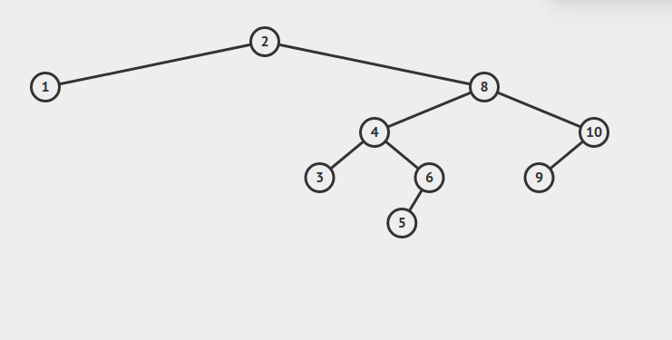

# Introdução

Bem-vindo ao seu manual para o curso de EDA, nesse git vamos tentar deixar você ligado nos, conceitos, implementação, importância e métodos acerca de estrutura de dados. Bom, sem mais delongas... vamos começar!

***
## Definição

  Segundo a definição de Anany Levitin, em seu livro "*The Design and Analysis of Algorithms*" : "*Uma estrutura de dados pode ser definida como um esquema particular para organizar dados relacionados*", ou seja, uma estrutura de dados (EDA) é apenas uma forma de organizar dados. As EDA's estão implicitamente presentes na nossa vida o tempo todo, listas, filas, pilhas são os casos mais evidentes disso.
  ___

  Para alguém que ainda nunca ouviu falar sobre EDA's a principal dúvida é : **porque devo estudar EDA**, espero esclarecer essa dúvida com um exemplo simples antes de seguirmos para teoria e código.

  **Exemplo**

  Digamos que precisamos consultar em nosso banco de dados se determinada matrícula de aluno foi cadastrada. Vamos a algumas alternativas:


  Bom, podemos manter uma lista de alunos (na ordem em que foram cadastrados) e procurar sequencialmente se determinada matrícula esta no nosso sistema com o seguinte código:

**Código**
```
  for(i=0; i<tamanho_vetor; i++){
    verificar_se_cadastrado(argumento);
  }
```
___
**Nosso banco**

  **[2][8][4][10][6][1][9][3][5]**

  Considerando que iremos começar da esquerda para a direita a nossa busca, podemos ver que podemos encontrar o número **2** com apenas uma consulta, no entando o número **5** demandaria muitas consultas (no nosso caso temos poucos números, no entanto, se tivessémos em nosso banco 10^65 cadastros e o nosso aluno fosse o último iriamos fazer 10^65 testes antes de encontrar nosso aluno).

___

Uma coisa curiosa é que este nosso banco pode ser interpretado como uma EDA. Nossos dados estão sendo guardados conforme a ordem de entrada um após o outro, podemos implementar esse banco em uma lista ligada ou em um vetor por exemplo. Agora que vem uma parte legal das EDA's, apenas mudando a nossa EDA, podemos deixar o nosos algoritmo de busca muito mais eficiente! Como exemplo usarei a Árvore binária de busca, porém, não deixarei o código pois voltaremos nas BST's no final do nosso curso.



Essa arvore binária tem como regra de deixar todos os números menores do que um determinado nó para a esquerda e os maiores para a direita. O importante é que agora podemos encontrar no número **5** (último da lista) com apenas 5 visitas (visitamos os nós 2->8->4->6->5).

Isso melhorou a  eficiencia do nosso algoritmo para casos extremamente grandes, no nosso exemplo de **10^65** uma Arvore Binária necessita apenas de **215** acessos para encontrar um número em seu pior caso. Claro, esse exemplo não mostra toda a vantagem de estudar EDA, mas pare para refletir que apenas mudando a minha Estrutura de Dados consigo diminuir um algoritmo que faria **10^65** passos para encontrar um cadastro para apenas **215**.

___

Não é o exemplo mais emocionante que podemos dar, no entanto, creio que basta para demonstrar a importância de EDA's para os seus software. Tente imaginar em quantas empresas não conseguiriam entregar seus serviços caso não tivessem soluções como essas em seus repertórios. Agora tentem imaginar quantos problemas complexos você pode (e vai) resolver apenas com conceitos básico de Estrutura de Dados
___
